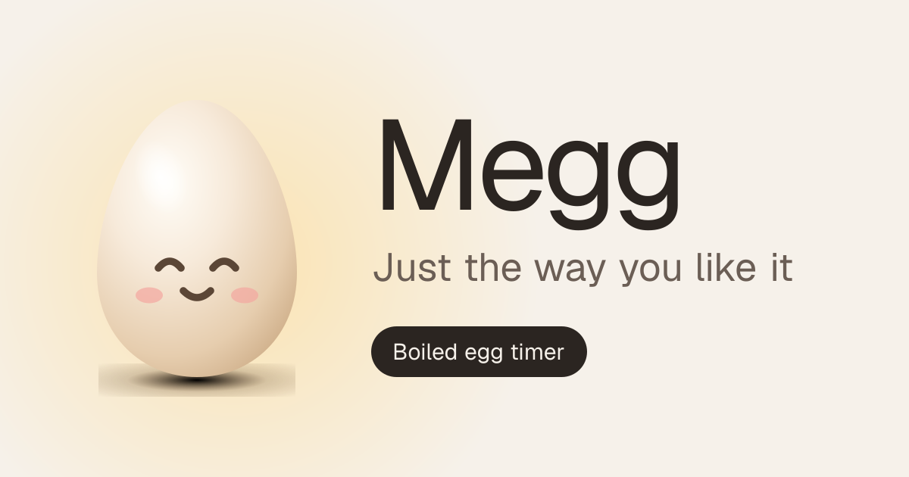
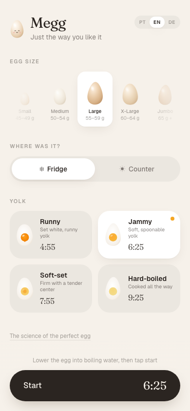

# Megg

<p align="center">
  
</p>

**Just the way you like it.** A mobile-first boiled-egg timer that finds the exact cook time from the egg’s weight, starting temperature, and yolk doneness — then counts down and rings when it’s ready.

Live: [megg-zeta.vercel.app](https://megg-zeta.vercel.app)

<p align="center">
  
</p>

Built with Next.js 16, Tailwind CSS 4, and Motion.

## Features

- Five egg sizes (Small → Jumbo) based on official Brazilian weight classes
- Fridge vs room temperature, with a room-temp slider
- Four yolk points: runny, jammy, firm, hard-boiled
- Portuguese, English, and German (auto-detected, switchable)
- Animated timer that looks like an egg in a pot
- Alarm that keeps working when the screen locks (best as an installed PWA)
- Light and dark mode from the system theme
- Installable on the home screen (PWA)

## How the time is calculated

Eggs go straight into already-boiling water. Base times come from a weight table (runny / jammy / firm / hard), then:

- Heavier eggs take longer, scaled with mass<sup>2/3</sup>
- Fridge-cold eggs add about 30 seconds versus a 20 °C egg
- Warmer room temperatures cook a bit faster

After the alarm: an ice bath (or cold running water) stops carryover cooking. Starting in boiling water is what helps peeling most.

## Development

```bash
npm install
npm run dev      # http://localhost:3000
npm run lint
npm run build && npm run start
```

## Project layout

- `src/app/` — page, layout, metadata, icons, Open Graph image, robots, sitemap, manifest, 404
- `src/components/` — `Setup`, `Timer`, `Done`, and the `Egg` illustration
- `src/lib/eggs.ts` — sizes, doneness, and the cook-time formula
- `src/lib/i18n.tsx` — Portuguese, English, and German copy
- `src/lib/site.ts` — site URL, name, and SEO text
- `public/llms.txt` — short description for LLM crawlers
- `public/sw.js` — service worker for notifications and a light offline cache

## Deploy

Set `NEXT_PUBLIC_SITE_URL` to the production origin (for example `https://megg-zeta.vercel.app`) before building. It drives canonical URLs, Open Graph, `robots.txt`, and `sitemap.xml`.

```bash
npx vercel --prod
```

On iPhone, add the site to the Home Screen from Safari so notifications can work. On Android, use Chrome’s “Install app”.
